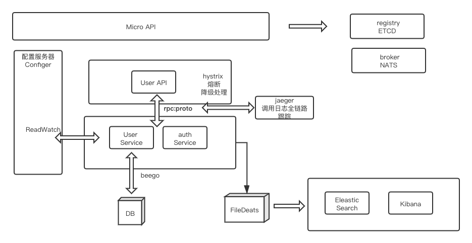

# 欢迎使用GO Micro API Framework

@(示例笔记本)[马克飞象|帮助|Markdown]

Micro API Framework 是一款基于go-micro打造的start-kit微服务框架，项目参考micro-go [中文社区](https://github.com/micro-in-cn/)。

如果您考虑采用**轻量级服务框架** 请参见 [Gin_API_Framework](https://github.com/edisonlz/Gin_API_Framework)


Framework特点：
 
- **功能丰富** ：[beego](https://beego.me/) MVC模型,RPC,API；
- **深度整合** ：[micro](https://github.com/micro/micro) 框架。
- **服务安全** ：采用 [hystrix](https://github.com/afex/hystrix-go)做熔断和降价处理
- **全链路日志跟踪** ：采用opentracing框架的[jaeger](https://github.com/jaegertracing/jaeger)开源项目
- **得心应手** ：简单的实例，非常容易上手；
**轻量级框架** 请参见 [Gin_API_Framework](https://github.com/edisonlz/Gin_API_Framework)
#### framework 架构图


####
服务启动顺序

1.register 这里我们使用比较成熟的etcd作为我们的register，etcd内部采用Raft一致性算法,被大数据应用洗礼多年，比较稳定
```bash
$ etcd
```

2.cd Micro_API_Framework/config-grpc-service
启动全局config服务器
```go
$ go run main.go
```

3.cd  Micro_API_Framework/auth_service
启动go-micro auth rpc service,协议 protobuf
创建protobuf rpc协议文件，请参见 https://micro.mu/docs/framework.html


```go
$ go run main.go
```

4.cd  Micro_API_Framework/user_service
启动go-micro user rpc service,协议 protobuf
协议中包括通过用户名请求 用户数据


```go
$ go run main.go
```

5. cd Micro_API_Framework/user_api
启动API协议
```go
$ go run main.go
```
**重点**：API 调用Service做了熔断和降级处理，
不使用传统的WaitGroup和Context来调用goroutines，当然 hystrix 代码里面包着的就是Context，可以看做Context的高级接口
- 5.1 配置必要参数
```go
Timeout:               1000, //1秒超时
MaxConcurrentRequests: 100, //设置max concurrent
ErrorPercentThreshold: 50, //错误率达到50%降级操作
```

- 5.2 执行goroutines
```go
 hystrix.Go("MakeAccessToken",
  func(){}, 
  func(err error) error {})
```

- 5.3 通过channel通信
```go
output_chan := make(chan *auth.Response, 1)
```

```go
func ServiceAuth(serviceClient auth.Service, r *http.Request,rsp *us.Response)(token_response *auth.Response, err error){

    ctx := r.Context()

    output_chan := make(chan *auth.Response, 1)
    errors_chan := make(chan string, 1)


    // 调用后台服务
    hystrix.ConfigureCommand("MakeAccessToken", hystrix.CommandConfig{
        Timeout:               1000, //1秒超时
        MaxConcurrentRequests: 100, //设置max concurrent
        ErrorPercentThreshold: 50, //错误率达到50%降级操作
    })

    // 根据自身业务需求封装到http client调用处
    hystrix.Go("MakeAccessToken", func() error {
        token_response, err := serviceClient.MakeAccessToken(ctx, &auth.Request{
            UserId:   rsp.User.Id,
            UserName: rsp.User.Name,
        })
        fmt.Println(rsp)
        fmt.Println(err)
        output_chan <- token_response

        return nil
    },
    func(err error) error {
        // 失败重试，降级等具体操作
        fmt.Println("get an error, handle it")
        errors_chan <- "error down user backup data"
        return nil
    })

    select {
        case token_response := <-output_chan:
            close(output_chan)
            return token_response , nil
        case err := <-errors_chan:
            close(errors_chan)
            return nil , errors.New(err)
    }
    
    
}
```

6. 启动jaeger UI
```
docker run -d --name jaeger 
-e COLLECTOR_ZIPKIN_HTTP_PORT=9411 
-p 5775:5775/udp 
-p 6831:6831/udp 
-p 6832:6832/udp 
-p 5778:5778 
-p 16686:16686 
-p 14268:14268 
-p 9411:9411 
jaegertracing/all-in-one:1.6
```


7.创建用户表，并测试返回结果
```sql
CREATE TABLE `user`
(
    `id`           int(10) unsigned                                              NOT NULL AUTO_INCREMENT COMMENT '主键',
    `user_id`      int(10) unsigned                                                       DEFAULT NULL COMMENT '用户id',
    `user_name`    varchar(20) CHARACTER SET utf8mb4 COLLATE utf8mb4_0900_ai_ci  NOT NULL COMMENT '用户名',
    `pwd`          varchar(128) CHARACTER SET utf8mb4 COLLATE utf8mb4_0900_ai_ci NOT NULL COMMENT '密码',
    `created_time` timestamp(3)                                                  NOT NULL DEFAULT CURRENT_TIMESTAMP(3),
    `updated_time` timestamp(3)                                                  NOT NULL DEFAULT CURRENT_TIMESTAMP(3) ON UPDATE CURRENT_TIMESTAMP(3),
    PRIMARY KEY (`id`),
    UNIQUE KEY `user_user_name_uindex` (`user_name`),
    UNIQUE KEY `user_user_id_uindex` (`user_id`)
) ENGINE = InnoDB
  DEFAULT CHARSET = utf8mb4
  COLLATE = utf8mb4_bin COMMENT ='用户表';

  INSERT INTO user (user_id, user_name, pwd) VALUE (10001, 'micro', '123');

```
启动micro
```gp
$ micro --registry=etcd --selector=cache --client_pool_size=10  --api_namespace=api.micro.platform.web  api --handler=web
```

```bash
curl --request POST   --url http://127.0.0.1:8080/user/login   --header 'Content-Type: application/x-www-form-urlencoded'  --data 'userName=micro&pwd=123'
```


**最后** 启动broker的消息队列服务建议采用分布式队列 NATS
详见 https://docs.nats.io/

#### 下个版本升级
- 1.recover引入
- 2.[zap](https://github.com/uber-go/zap)日志持久化引入
- 3.分布式配置系统


